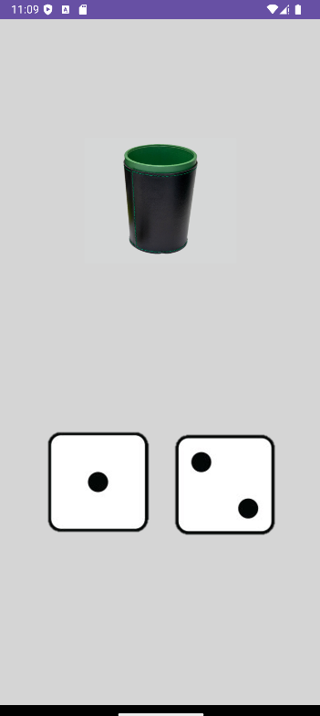
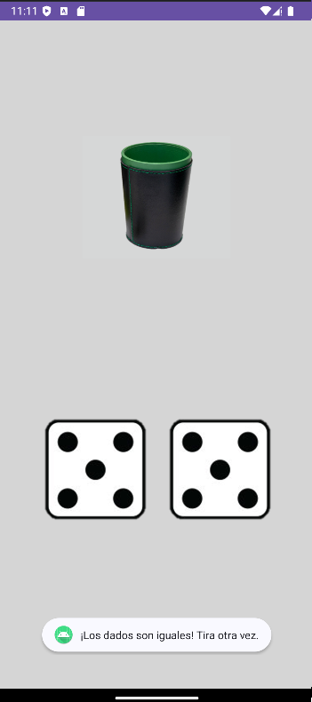

# 🎲 Proyecto Cubo de Dados

¡Bienvenido al proyecto **Cubo de Dados**! 🎉 Este es un divertido juego de dados en Android donde puedes hacer clic en un cubo para lanzar dos dados, y si caen iguales, ¡te dará un aviso especial!

---

## 🔧 Características

- **Interactividad**: Haz clic en el cubo para lanzar los dados.
- **Resultados aleatorios**: Los dados se muestran de forma aleatoria.
- **Aviso**: Si los dados caen iguales, se muestra un mensaje de aviso.

---

## 🖼️ Pantallazos

Aquí puedes ver los pantallazos del proyecto:

### Pantallazo 1:
  
*Interfaz principal del juego.*

### Pantallazo 2:
  
*Resultado con los dados iguales.*

---

## 🚀 Instalación

1. Clona el repositorio:

   ```bash
   git clone https://github.com/Avalob/CuboDeDados.git
   
2. Abre el proyecto en **Android Studio**.
3. Conecta tu dispositivo o usa un emulador.
4. ¡Corre la aplicación! 🎮

---

## 💻 Tecnologías utilizadas

- **Android Studio**: IDE utilizado para desarrollar la aplicación.
- **Java**: Lenguaje de programación para la lógica de la aplicación.
- **XML**: Para la estructura de la interfaz de usuario.

---

## 📱 Demo

¡Puedes ver cómo funciona la app haciendo clic en el cubo! Si los dados son iguales, se mostrará un mensaje de alerta.

---

## 🧑‍💻 Contribuciones

Si deseas contribuir al proyecto, por favor sigue estos pasos:

1. Haz un fork del repositorio.
2. Crea una nueva rama (`git checkout -b feature/nueva-funcionalidad`).
3. Realiza tus cambios y haz un commit (`git commit -am 'Añadí nueva funcionalidad'`).
4. Haz push a la rama (`git push origin feature/nueva-funcionalidad`).
5. Crea un Pull Request.

---

